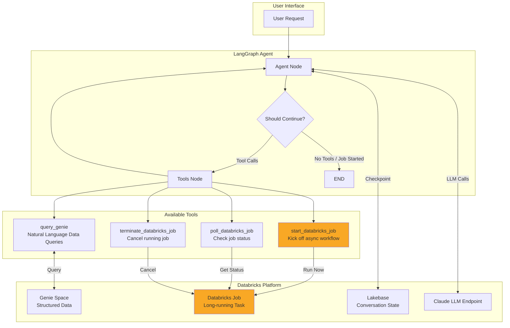

# Async Databricks Workflow Agent

A LangGraph-based supervisor agent that runs on Databricks, featuring asynchronous job execution, Genie integration for natural language data queries, and conversation state persistence via Lakebase.

## Architecture



### Workflow Description

1. **User Request**: User sends a message to the agent
2. **Agent Processing**: The LangGraph agent processes the request using Claude LLM
3. **Tool Selection**: Agent decides which tool(s) to use based on the request:
   - **Genie**: For data queries against structured data
   - **Start Job**: For complex, long-running tasks
   - **Poll Job**: When user asks about job status
   - **Terminate Job**: When user wants to cancel a job
4. **Async Job Handling**: When `start_databricks_job` is called:
   - Job is kicked off with user's request as parameter
   - Agent immediately returns the `run_id` to the user
   - Graph exits (does not poll automatically)
   - User can check status later with a follow-up request
5. **State Persistence**: Conversation state is checkpointed to Lakebase for multi-turn conversations

## Project Structure

```
async-databricks-workflow/
├── agent/
│   ├── agent.py              # Main agent implementation (LangGraphResponsesAgent)
│   ├── config.yaml           # All configuration (LLM, Genie, Job settings)
│   ├── utils/
│   │   ├── __init__.py
│   │   ├── databricks_client.py   # Singleton WorkspaceClient
│   │   └── tool_responses.py      # Standardized response helpers
│   └── workflow_tools/
│       ├── __init__.py
│       ├── job_tools.py      # Databricks job management tools
│       └── genie_tools.py    # Genie natural language query tool
├── main.py                   # Local development entry point
├── requirements.txt          # Python dependencies
└── .env                      # Environment variables (not in git)
```

## Prerequisites

- Python 3.10+
- Databricks workspace with:
  - Model Serving endpoint (Claude LLM)
  - Lakebase instance for checkpointing
  - Genie Space (optional, for data queries)
  - Databricks Job configured (for async workflows)

## Installation

1. **Clone the repository**
   ```bash
   git clone <repository-url>
   cd async-databricks-workflow
   ```

2. **Create virtual environment**
   ```bash
   python -m venv .venv
   source .venv/bin/activate  # On Windows: .venv\Scripts\activate
   ```

3. **Install dependencies**
   ```bash
   pip install -r requirements.txt
   ```

4. **Set up environment variables**

   Create a `.env` file in the project root:
   ```bash
   DATABRICKS_HOST=https://<your-workspace>.cloud.databricks.com
   DATABRICKS_TOKEN=<your-personal-access-token>
   ```

5. **Configure the agent**

   Edit `agent/config.yaml` with your settings:
   ```yaml
   # MLflow configuration
   mlflow_experiment_id: "<your-experiment-id>"

   # LLM endpoint
   llm_endpoint_name: "databricks-claude-sonnet-4-5"

   # Lakebase instance for conversation state
   lakebase_instance_name: "<your-lakebase-instance>"

   # Databricks job for async workflows
   databricks_job_id: "<your-job-id>"

   # Genie configuration (optional)
   genie:
     space_id: "<your-genie-space-id>"
     agent_name: "Genie"
     description: "Description of what data Genie can query"
   ```

## Running the Agent

### Local Development

```bash
python main.py
```

This runs the agent with example inputs defined in `main.py`.

### Deploying to Databricks

The agent is designed to be deployed as an MLflow model on Databricks Model Serving:

```python
import mlflow

# Register the model
mlflow.set_registry_uri("databricks-uc")
with mlflow.start_run():
    logged_agent = mlflow.pyfunc.log_model(
        name="agent",
        python_model="agent/agent.py",
        pip_requirements=["databricks-langchain", "langgraph", "mlflow"]
    )

# Register to Unity Catalog
mlflow.register_model(
    model_uri=logged_agent.model_uri,
    name="<catalog>.<schema>.<model_name>"
)

# Deploy
from databricks import agents
agents.deploy("<catalog>.<schema>.<model_name>", version="1")
```

## Tools Reference

### query_genie
Query structured data using natural language through Databricks Genie.

**Parameters:**
- `query` (str): Natural language question about the data

**Example:**
```
User: "What was our total revenue last quarter?"
Agent: [Uses query_genie to get data from Genie Space]
```

### start_databricks_job
Kick off a long-running Databricks job with the user's request.

**Parameters:**
- `user_request` (str): The user's request to pass to the job
- `notebook_params` (dict, optional): Additional parameters for the notebook

**Behavior:** After starting, the agent returns immediately with the `run_id`. It does NOT poll for completion automatically.

**Example:**
```
User: "Analyze all customer transactions for anomalies"
Agent: "Job started successfully. Run ID: 12345. You can check the status later."
```

### poll_databricks_job
Check the status of a previously started job.

**Parameters:**
- `run_id` (str): The run ID from start_databricks_job

**Example:**
```
User: "What's the status of job 12345?"
Agent: [Uses poll_databricks_job] "Job is still running..."
```

### terminate_databricks_job
Cancel a running job.

**Parameters:**
- `run_id` (str): The run ID to cancel

**Example:**
```
User: "Cancel job 12345"
Agent: [Uses terminate_databricks_job] "Job cancelled successfully."
```

## Configuration Reference

| Parameter | Description |
|-----------|-------------|
| `mlflow_experiment_id` | MLflow experiment for tracking |
| `llm_endpoint_name` | Databricks Model Serving endpoint for Claude |
| `system_prompt` | System prompt for the agent |
| `lakebase_instance_name` | Lakebase instance for conversation checkpointing |
| `databricks_job_id` | Job ID for async workflow execution |
| `genie.space_id` | Genie Space ID for data queries |
| `genie.agent_name` | Display name for Genie agent |
| `genie.description` | Description of Genie capabilities |

## Multi-turn Conversations

The agent supports multi-turn conversations via Lakebase checkpointing. Thread IDs are managed automatically:

1. First request: Agent generates a new `thread_id`
2. Response includes `thread_id` in `custom_outputs`
3. Subsequent requests: Pass `thread_id` in `custom_inputs` to continue the conversation

```python
# First request
response = AGENT.predict({
    "input": [{"role": "user", "content": "Start job for data analysis"}],
    "custom_inputs": {}
})

thread_id = response.custom_outputs["thread_id"]

# Follow-up request (same conversation)
response = AGENT.predict({
    "input": [{"role": "user", "content": "What's the job status?"}],
    "custom_inputs": {"thread_id": thread_id}
})
```

## License

[Add your license here]
