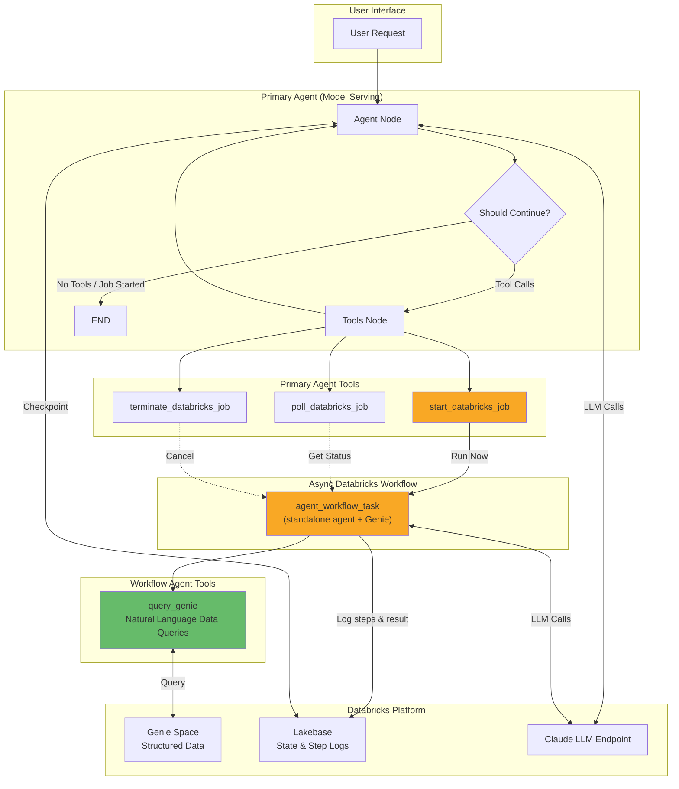

# Async Databricks Workflow Agent

Demonstrates asynchronous inference using Databricks workflows with two independent agents:

- **Primary agent** (`agent/`) — deployed on Model Serving, triages requests and delegates data questions to an async Databricks workflow
- **Workflow task agent** (`async_job/src/`) — self-contained LangGraph agent with Genie tools, runs inside a Databricks job task, logs intermediate steps and results to Lakebase

## Architecture



### How It Works

1. **User Request** arrives at the primary agent (deployed on Model Serving)
2. **Triage**: The primary agent decides how to handle the request:
   - **Simple questions** (greetings, clarifications) — answered directly
   - **Data/research questions** — delegated via `start_databricks_job`
3. **Async Delegation**: When a job is started:
   - The user's request is passed as a job parameter
   - The primary agent immediately returns the `run_id` and exits
   - The Databricks workflow launches `agent_workflow_task`
4. **Workflow Task Agent**: A self-contained LangGraph agent (no dependency on `agent/`) with Genie tools:
   - Calls `query_genie` to answer data questions
   - Logs each tool call and tool result to Lakebase as intermediate steps
   - Logs the final response to Lakebase on completion
5. **Follow-up**: The user can poll job status or cancel via the primary agent

## Project Structure

```
async-databricks-workflow/
├── agent/                         # Primary agent (Model Serving)
│   ├── agent.py                   # LangGraphResponsesAgent — job tools only
│   ├── config.yaml                # LLM, job, Lakebase, deployment settings
│   ├── config_loader.py           # Cached config accessors
│   ├── tools/
│   │   ├── __init__.py
│   │   └── job_tools.py           # start/poll/terminate Databricks jobs
│   └── utils/
│       ├── __init__.py
│       ├── databricks_client.py   # Singleton WorkspaceClient
│       ├── environment.py         # Env var validation
│       ├── mlflow_utils.py        # MLflow tracking/registry setup
│       └── tool_responses.py      # Standardized response helpers
├── async_job/                     # Workflow task agent (DAB)
│   ├── resources/
│   │   └── async_job.job.yml      # Job definition
│   └── src/
│       ├── __init__.py
│       ├── agent_workflow_task.py  # Standalone LangGraph agent with Genie
│       ├── genie_tools.py         # Genie tool (self-contained)
│       ├── lakebase_utils.py      # Lakebase connection and logging
│       └── schema.py              # task_logs table schema
├── databricks.yml                 # Root DAB config (deploys full project)
├── main.py                        # Local development entry point
├── requirements.txt               # Python dependencies
└── .env                           # Environment variables (not in git)
```

### Two Independent Agents

The agents are **completely separate** — the workflow task agent has zero imports from `agent/`.

| | Primary Agent (`agent/`) | Workflow Task Agent (`async_job/src/`) |
|---|---|---|
| **Tools** | `start/poll/terminate_databricks_job` | `query_genie` |
| **Runs on** | Model Serving | Databricks workflow task (serverless) |
| **Config source** | `agent/config.yaml` | CLI args + env vars + defaults |
| **State** | Lakebase checkpointing (multi-turn) | Logs steps to Lakebase `task_logs` |
| **LLM** | `databricks-claude-sonnet-4-5` | `databricks-claude-sonnet-4-5` |

## Prerequisites

- Python 3.10+
- Databricks workspace with:
  - Model Serving endpoint (Claude LLM)
  - Lakebase instance for checkpointing and step logging
  - Genie Space for data queries

## Installation

1. **Clone the repository**
   ```bash
   git clone <repository-url>
   cd async-databricks-workflow
   ```

2. **Create virtual environment**
   ```bash
   python -m venv .venv
   source .venv/bin/activate
   ```

3. **Install dependencies**
   ```bash
   pip install -r requirements.txt
   ```

4. **Set up environment variables**

   Create a `.env` file in the project root:
   ```bash
   DATABRICKS_HOST=https://<your-workspace>.cloud.databricks.com
   DATABRICKS_TOKEN=<your-personal-access-token>
   ```

5. **Configure the primary agent**

   Edit `agent/config.yaml`:
   ```yaml
   mlflow_experiment_id: "<your-experiment-id>"
   llm_endpoint_name: "databricks-claude-sonnet-4-5"
   lakebase_instance_name: "<your-lakebase-instance>"
   databricks_job_id: "<your-job-id>"  # Set after deploying the DAB
   ```

6. **Configure the workflow task agent**

   Defaults are set in `async_job/src/agent_workflow_task.py` via env vars:
   - `LLM_ENDPOINT_NAME` — LLM endpoint (default: `databricks-claude-sonnet-4-5`)
   - `GENIE_SPACE_ID` — Genie space ID
   - `GENIE_DESCRIPTION` — Genie tool description

   The Lakebase instance is passed via the DAB variable `lakebase_instance` (defined in `databricks.yml`).

## Deployment

### 1. Deploy the Async Job (DAB)

Deploy from the project root (the `databricks.yml` is at the root so both `agent/` and `async_job/` are included):

```bash
databricks bundle deploy --target dev

# Get the job ID from the output or list jobs
databricks jobs list --name async_job
```

Update `databricks_job_id` in `agent/config.yaml` with the job ID from the output.

To redeploy after code changes:

```bash
databricks bundle deploy --target dev
```

### 2. Deploy the Primary Agent to Model Serving

```bash
python main.py  # Local test first
```

## Intermediate Step Logging

The workflow task agent logs each step to the `task_logs` table in Lakebase:

| status | description |
|--------|-------------|
| `tool_call` | Agent decided to call a tool (includes tool name and arguments) |
| `tool_result` | Tool returned a result (includes output) |
| `completed` | Final agent response text |

Each log entry includes a `step` number, timestamp, and the full message payload as JSON. This allows monitoring agent progress while the async job is running.

## Multi-turn Conversations

The primary agent supports multi-turn conversations via Lakebase checkpointing:

```python
# First request
response = AGENT.predict({
    "input": [{"role": "user", "content": "Analyze customer revenue trends"}],
    "custom_inputs": {}
})

thread_id = response.custom_outputs["thread_id"]

# Follow-up request (same conversation)
response = AGENT.predict({
    "input": [{"role": "user", "content": "What's the job status?"}],
    "custom_inputs": {"thread_id": thread_id}
})
```

## Configuration Reference

### Primary Agent (`agent/config.yaml`)

| Parameter | Description |
|-----------|-------------|
| `mlflow_experiment_id` | MLflow experiment for tracking |
| `llm_endpoint_name` | Databricks Model Serving endpoint for Claude |
| `system_prompt` | System prompt for the primary agent |
| `lakebase_instance_name` | Lakebase instance for conversation checkpointing |
| `databricks_job_id` | Job ID for async workflow execution |

### Workflow Task Agent (DAB variables in `databricks.yml`)

| Variable | Description | Default |
|----------|-------------|---------|
| `lakebase_instance` | Lakebase instance for step logging | `doan-langgraph-memory` |

### Workflow Task Agent (env vars / defaults in `agent_workflow_task.py`)

| Env Var | Description | Default |
|---------|-------------|---------|
| `LLM_ENDPOINT_NAME` | LLM endpoint | `databricks-claude-sonnet-4-5` |
| `GENIE_SPACE_ID` | Genie Space ID | (hardcoded) |
| `GENIE_DESCRIPTION` | Genie tool description | (hardcoded) |

## License

[Add your license here]
